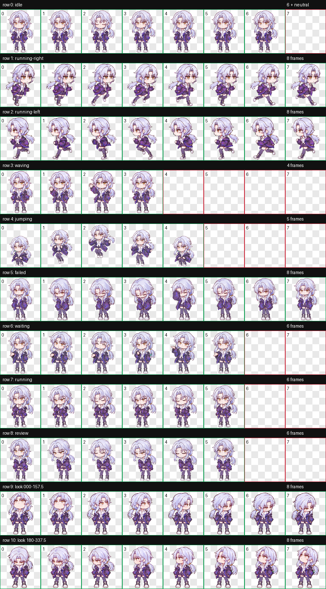
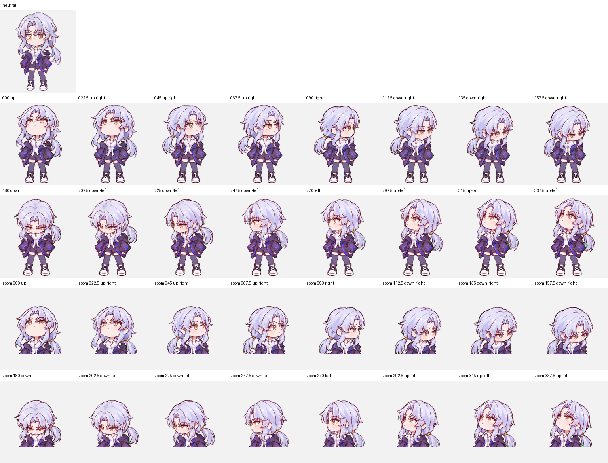

# QA 摘要

本页记录 `v1.0.0` 发布前的可复核结论。公开仓库保留最终文件和精选预览；包含原始参考图、生成提示、临时帧、浏览器日志及本机路径的完整制作档案留在私有归档仓库。

## 确定性检查

| 检查项 | 结果 |
| --- | --- |
| `pet.json` 可解析，必需字段存在 | 通过 |
| `spriteVersionNumber` | `2` |
| 图集格式与尺寸 | WebP，1536 × 2288 |
| 图集网格 | 8 × 11，单格 192 × 208 |
| 标准状态 | 9 组，共 57 帧 |
| 目光方向 | 16 |
| 透明边缘与色键抑制 | 通过 |
| 本地安装文件哈希与交付图集一致 | 通过 |
| 图集 SHA-256 | `6b1d64c1fb256fe4b3e973bfaef65f72cc8092ec6107fba7b05f7952739d8105` |

仓库中的 `scripts/validate_release.py` 会重新检查清单、文件名、WebP 尺寸、大小和 ZIP 内容一致性。GitHub Actions 会对每次提交和拉取请求执行相同检查。

## 视觉与交互检查

- 9 组标准动画已逐帧检查，动作行数量和切帧均符合清单。
- 浏览器预览已确认播放、暂停、深浅背景和 16 个鼠标方向映射。
- 四个正方向通过方向语义检查。
- `022.5°`、`045°`、`135°`、`225°`、`315°`、`337.5°` 在盲检中出现轻微左右辨识分歧；逐格复核后确认象限与顺序正确，作为已接受的视觉警告保留。
- 跳跃行使用共享槽位提取以保留真实起落高度，已通过播放稳定性复核。

## 验证边界

浏览器预览和文件校验均已通过。制作时未完成“在 Codex 悬浮层中选中紫团并覆盖所有状态”的端到端运行测试，因此发布说明不把浏览器结果表述为桌面悬浮层实测。

